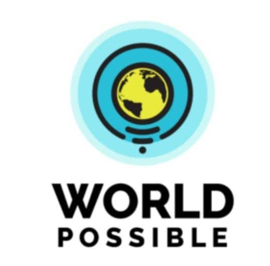
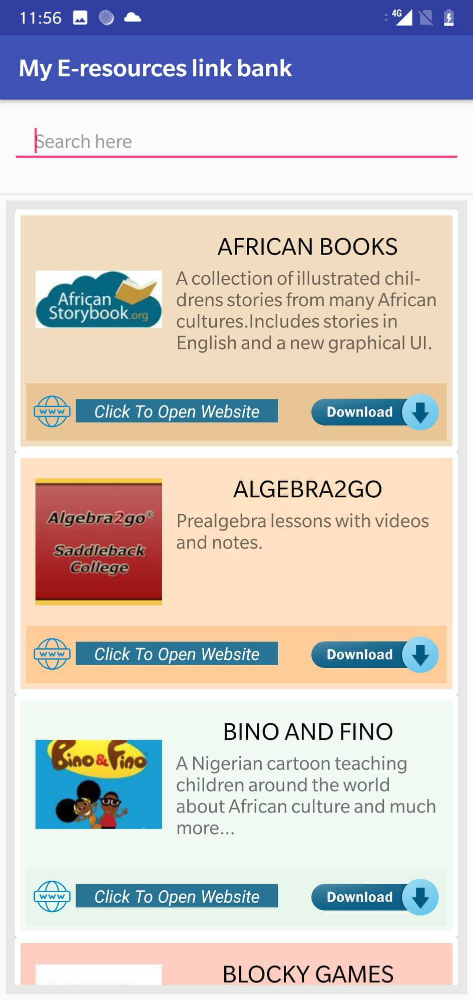
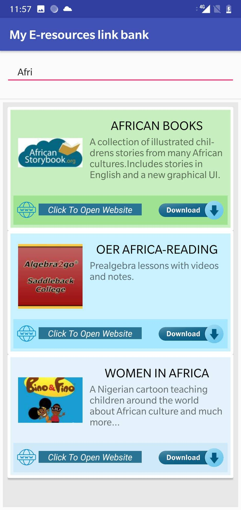
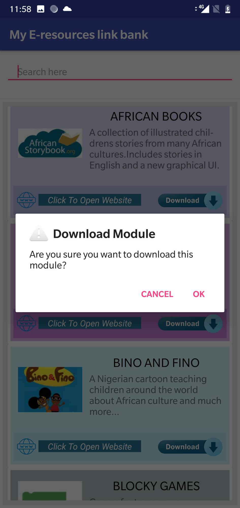

# PocketOER2GO

    
Open Educational Resources (OERs) are freely accessible content useful for teaching, learning and research.
They have revolutionized the way we learn by making a plethora of learning opportunities freely available to anyone with an internet connection.

Pocket OER2GO is an Android Application which contains all the OERs present on the World Possible website.This app was created for World Possible Hackathon 2018.Pocket OER2GO works without internet connection and it can be used for the four billion of the world’s population which lacks access to the internet and is unaware of the resources like  Wikipedia and Khan Academy. This will leads to an immense widening of the knowledge gap.

  

Every Resource in Pocket OER2GO is represented in cards.
Color of these cards changes dynamically whenever the activity gets refreshed.

  

Pocket OER2GO is equipped with `Live-Search`. *Live-Search* is used to replace String Search with the Character Search in the Recycler View.It makes searching of module effortless.

  

#### *Pocket OER2GO was awarded Runners Up at World Possible Hackathon 2018.*

World Possible is a Global NGO which is working towards offline learners to the worlds knowledge.
